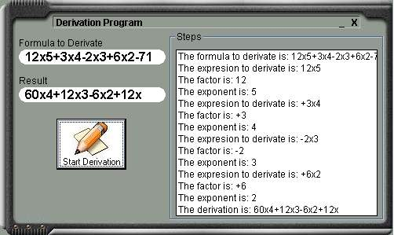



## The First Derivation Code

### Description

The purpose of this code is to make the derivation procedure. This code derivates a function (eg. 12x2+3x to 24x+3, for those who know how to derivate).

Well, this is my first code on pscode so I hope you enjoy it.

Please vote and/or leave your comments on my code in order to improve it.

PD: Sorry for my english, im from Chile.

PD: Im thinking on a new update that can work with negative exponents.
 
### More Info
 

             |
---                |---
**Submitted On**   |2002-11-01 09:57:34
**By**             |[Gaston Jorquera](https://github.com/Planet-Source-Code/PSCIndex/blob/master/ByAuthor/gaston-jorquera.md)
**Level**          |Intermediate
**User Rating**    |5.0 (10 globes from 2 users)
**Compatibility**  |VB 3\.0, VB 4\.0 \(16\-bit\), VB 4\.0 \(32\-bit\), VB 5\.0, VB 6\.0
**Category**       |[Math/ Dates](https://github.com/Planet-Source-Code/PSCIndex/blob/master/ByCategory/math-dates__1-37.md)
**World**          |[Visual Basic](https://github.com/Planet-Source-Code/PSCIndex/blob/master/ByWorld/visual-basic.md)
**Archive File**   |[The\_First\_1491091122002\.zip](https://github.com/Planet-Source-Code/gaston-jorquera-the-first-derivation-code__1-40359/archive/master.zip)

